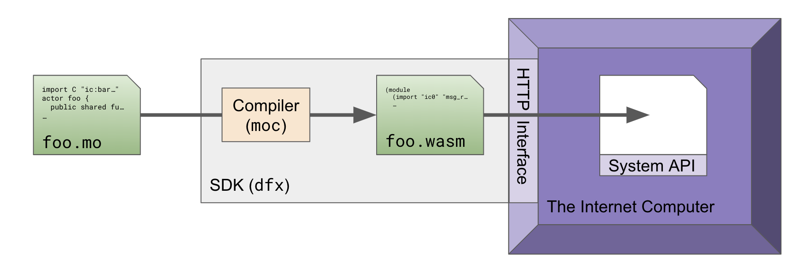

# Module 1: The Anatomy of Programming Languages
#### Outline
1. [What is a Programming Language?](#what-is-a-programming-language?)
2. [Modern Programming Language Architecture](#modern-programming-language-architecture)
    - [Types of Programming Languages](#Types-of-Programming-Languages)
	- [Program Compilation](#Program-Compilation)
	- [Typing](#typing)
3. [What’s Special About Motoko?](#What’s-Special-About-Motoko?)
	- [WebAssembly](#WebAssembly)
	- [Why Motoko?](#why-motoko?)
	- [Key Design Points](#key-design-points)

## What is a Programming Language?
Charles Babbage’s [Analytical Engine](https://en.wikipedia.org/wiki/Analytical_Engine), designed circa 1833, was one of the first known general-purpose computers, which resembled in logical structure the electronic computers that rose to prominence in the 1940s and evolved to today’s modern computer. Less than a decade after Babbages’s Engine was first designed, [Ada Lovelace](https://en.wikipedia.org/wiki/Ada_Lovelace) developed the first known computer program. These early computers were programmed using physical punched cards, and the language resembled modern-day [assembly languages](https://en.wikipedia.org/wiki/Assembly_language).

Programming languages allow humans to easily interface with computers by writing formal sets of instructions. However, early programming languages developed for conventional use with electronic computers required **low-level**implementations due to limited computer memory and speed. “Low-level” programming languages, also called assembly languages, are simply languages with little abstraction - they closely correspond to the **machine code** instructions that the computer directly interprets to control the central processing unit (CPU). Machine code is “strictly numerical” in the sense that only consists of binary digits. As a result, it is difficult and time-consuming to directly program in.

As programming languages developed, a clear need for high-level languages emerged. Such languages are what we often recognize as the common programming languages of today, including Python, Java, and C, which allow programmers to abstract away from binary and instead write in easy-to-read, semi-English statements. The first high-level language emerged in the mid-1940s, opening the door for a new focus on language design and programming paradigm shifts.

## Modern Programming Language Architecture

### Types of Programming Languages

Two main programming paradigms exist today: **imperative** and **declarative**. In imperative programming, the programer instructs the computer how to execute a given task, resulting in a changed state. This contrasts with declarative programming, which specifies the desired result but not the instructions for how to compute it. A specific type of declarative programming is **functional** programming, whereby expressions are evaluated by applying and composing functions.

This distinction feels rather abstract, so let’s use a specific example to illustrate the main differences between the two. Let’s say you want to create a function that adds up a list of numbers. In Java, an imperative language, you might create a new variable to store the cumulative sum and then loop through the list, successively adding each value to that cumulative sum. The updating state change that occurs within in loop is referred to as a **side effect**, which means that it has an effect outside of just returning a value.

In Haskell, a functional programming language, loops (like for and while) aren’t necessary. Instead of updating the state of a program in a series of imperative statements, functional programs use recursion to successively apply functions to arguments - there is no “placeholder” variable that’s updated each run. Many programming languages share both elements of imperative and declarative styles, at times making it difficult to separate the two.
One final example of a strictly declarative language is SQL. The following query shows how you _declare_ what you want instead of describing how to get it.
`SELECT score FROM games WHERE id < 100;`

### Program Compilation

While high-level programming languages are generally easier for programmers to code in and understand, they cannot be directly executed by a computer’s CPU. **Compilation** is the process by which programs written in high-level languages are translated and processed into a lower-level language such as **machine code**(binary-like instructions). Compilation differs based on the programming language, but it often has several distinct steps that can be grouped into one of three stages: the front end, middle end, and back end.

In the _front end_, the language-specific syntax and semantics are verified. This part of the front end is often itself divided into phases that include lexical analysis, syntax analysis, and semantic analysis. If the language is statically typed, then type checking is performed in this stage. The source code is translated into an intermediate representation (IR), a lower-lever representation that is used in the middle end.

Next, the _middle end_ optimizes the IR in a CPU-agnostic way, allowing for this step to be carried out similarly regardless of computer architecture. Finally, the _back end_takes the optimized IR and translates it into machine code specific to that computer’s CPU and operating system. 

From  [https://en.wikipedia.org/wiki/Compiler#/media/File:Compiler_design.svg](https://en.wikipedia.org/wiki/Compiler#/media/File:Compiler_design.svg) 

Some programming languages, such as Python and Ruby, do not strictly use a compiler; instead, they use an **interpreter**, which is a piece of software that directly interprets and executes code instead of creating a separate, intermediary machine code file. Compiled programs typically have a lower code execution time because they have already been translated into machine code before runtime. 

### Typing

Computer programs utilize type systems to reduce bugs and to make it easier for programs to reliably interface with each other. **Type checking**, the process by which a program verifies and enforces the constraints set forth by its type system, can either occur at compile time (called **static** checking) or at run-time (**dynamic** checking). Statically typed languages require you to declare the data type of a variable before using it (like `int num = 5` in Java) while dynamically typed languages do not (like `num = 5` in python).

## What’s Special About Motoko

### WebAssembly

The Internet Computer does not directly run machine code, as a CPU might. Instead, the Internet Computer runs a low-level assembly language called WebAssembly. WebAssembly, designed with speed and compatibility in mind, was primarily created to support web-page applications, but its wide-scale compatibility enables use in applications like the Internet Computer.

As WebAssembly is a low-level language, developers do not directly code in it. Instead, they write in a higher-level language like Rust or C, which then complies into WebAssembly binary code. This binary code is ultimately what’s run on the Internet Computer. 

### Why Motoko?

Although there are several prominent languages available for WebAssembly development, none were built with the Internet Computer in mind.  [Motoko](https://sdk.dfinity.org/docs/language-guide/motoko.html)  was designed specifically for the Internet Computer and built with a focus on familiarity, safety, and compatibility. Developers will find familiarity in the syntax of Motoko, which borrows successful elements from other popular languages. 

Additionally, Motoko:
* Seamlessly fits the Internet Computer platform by specifically targeting WebAssembly
* Maintains features built with the Internet Computer in mind, such as canisters and caller identity
* Provides built-in support for inter-canister calls with `async` and `await`
* Promotes language interoperability through the use of Candid, a language that allows canisters written in different languages to communicate with each other

While Motoko is optimized for the Internet Computer, it is not the only language, nor always the best language, for the platform. Generally, however, developers will find it easiest to write code for Internet Computer canisters using Motoko.

### Key Design Points

Motoko is a statically-typed, object-oriented, functional, and imperative language, taking inspiration from Javascript, C#, Swift, Pony, ML, and Haskell. The object-oriented style incorporates elements such as encapsulated state and public/private methods. It’s also possible to write in both functional and imperative styles to increase flexibility.

Motoko produces Candid files that describe service-level message-type signatures, allowing canisters written in different languages to interact with each other. 
